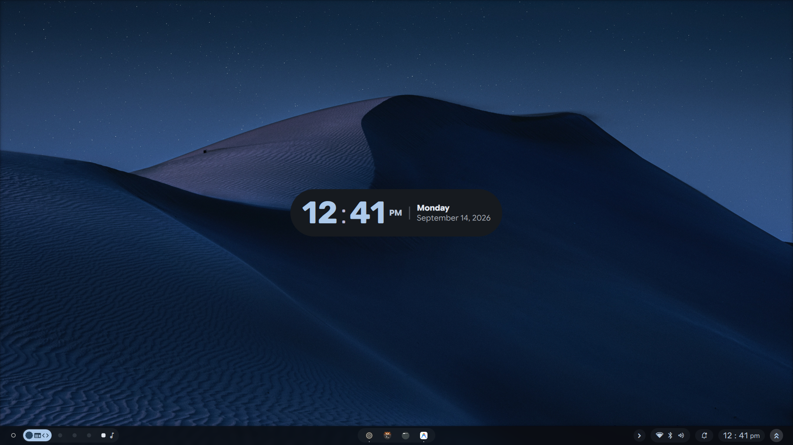
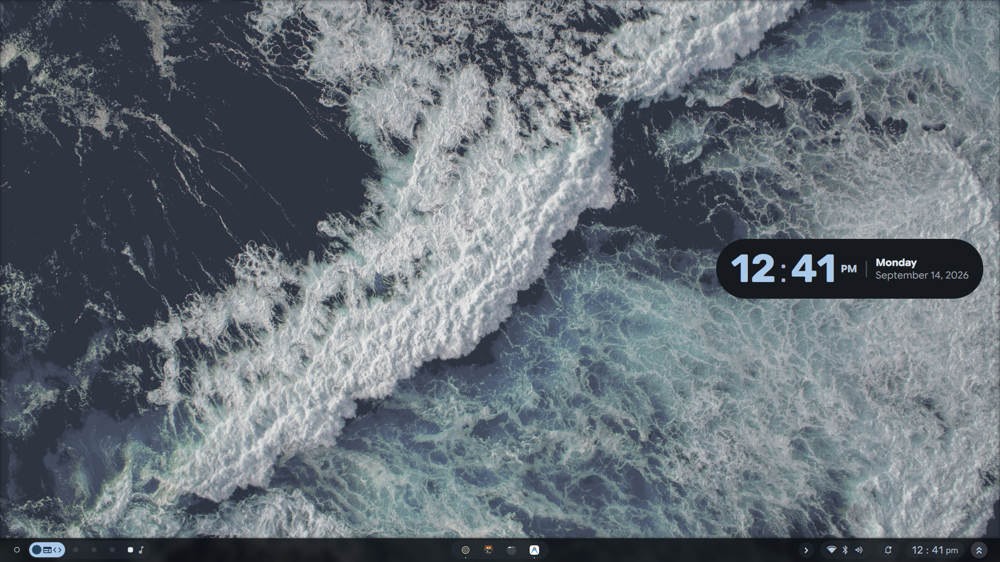
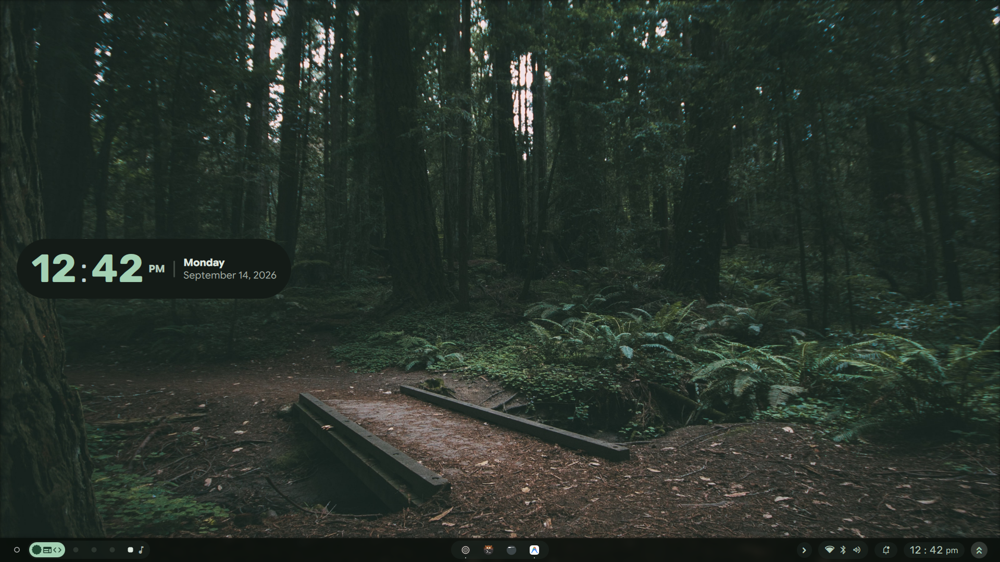
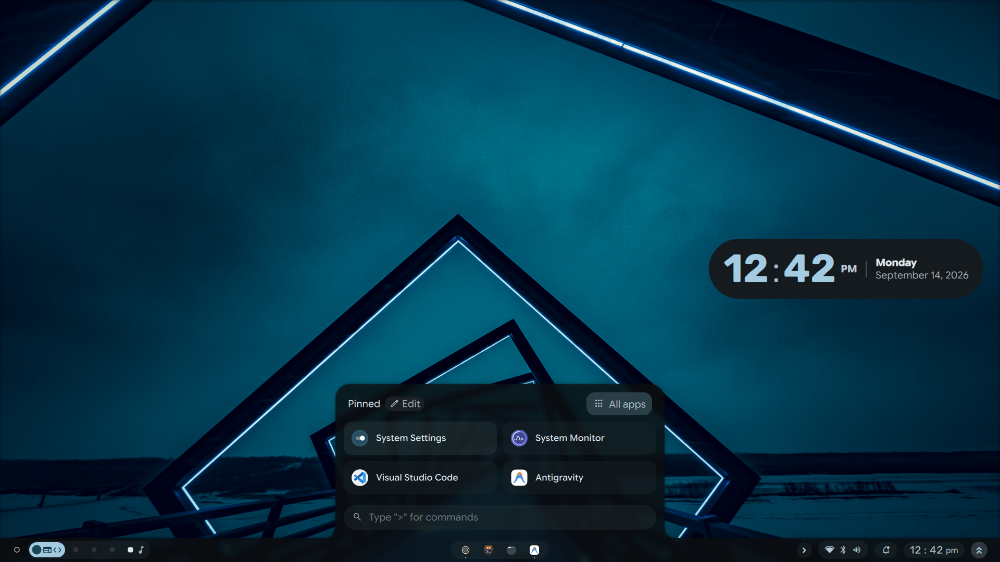
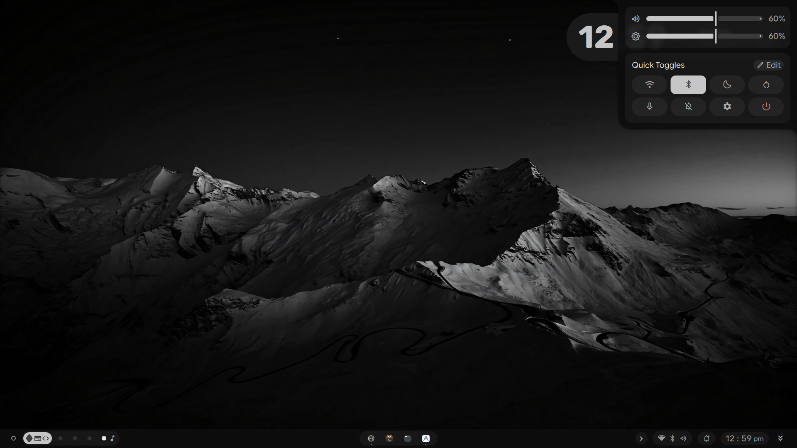
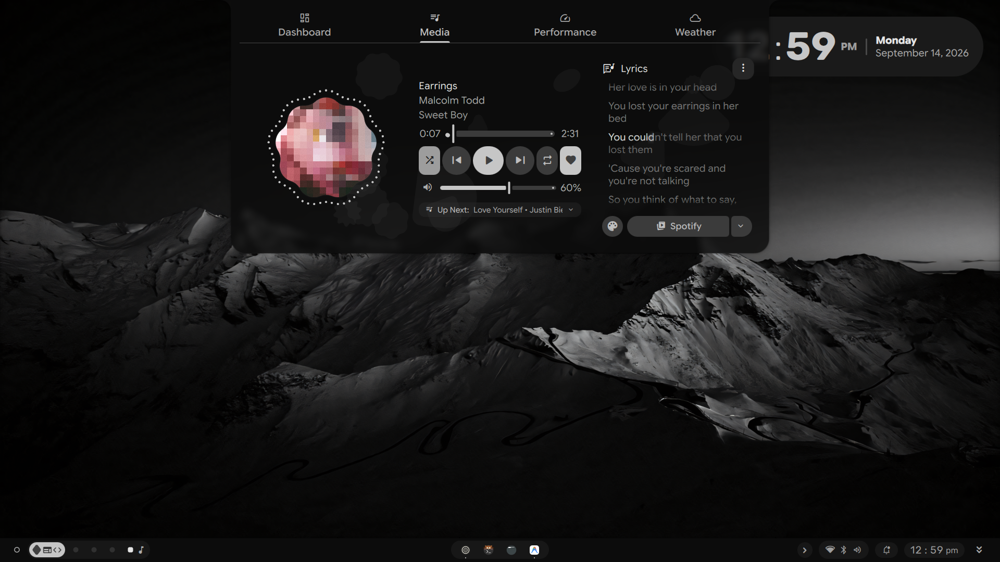
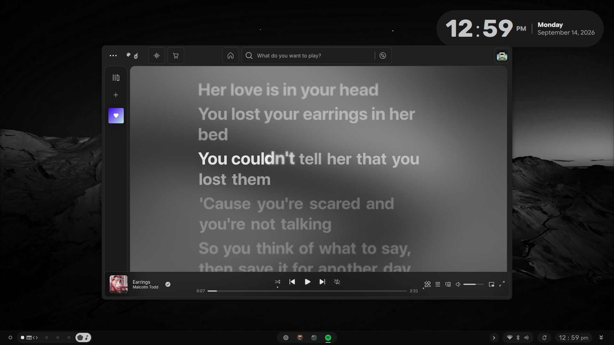
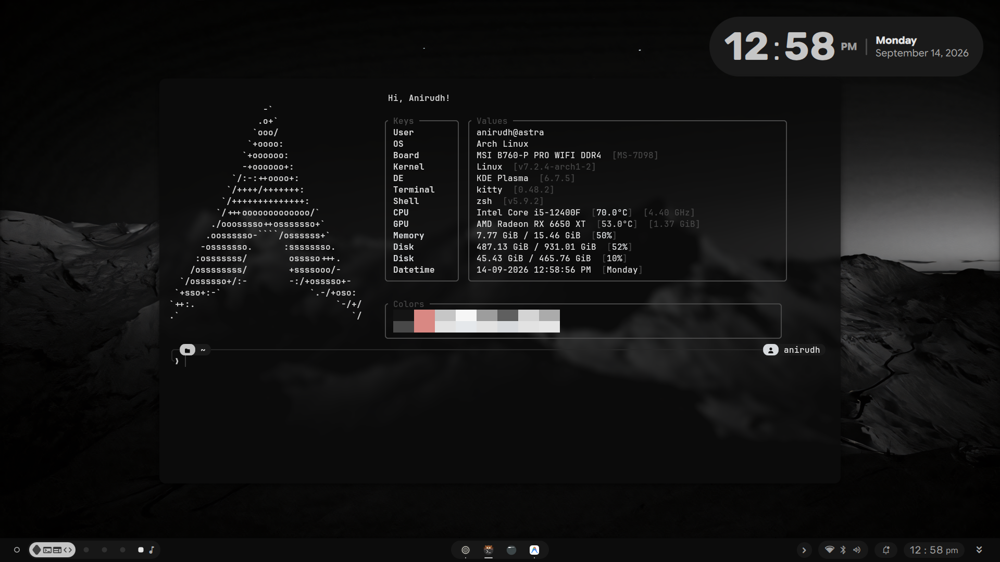
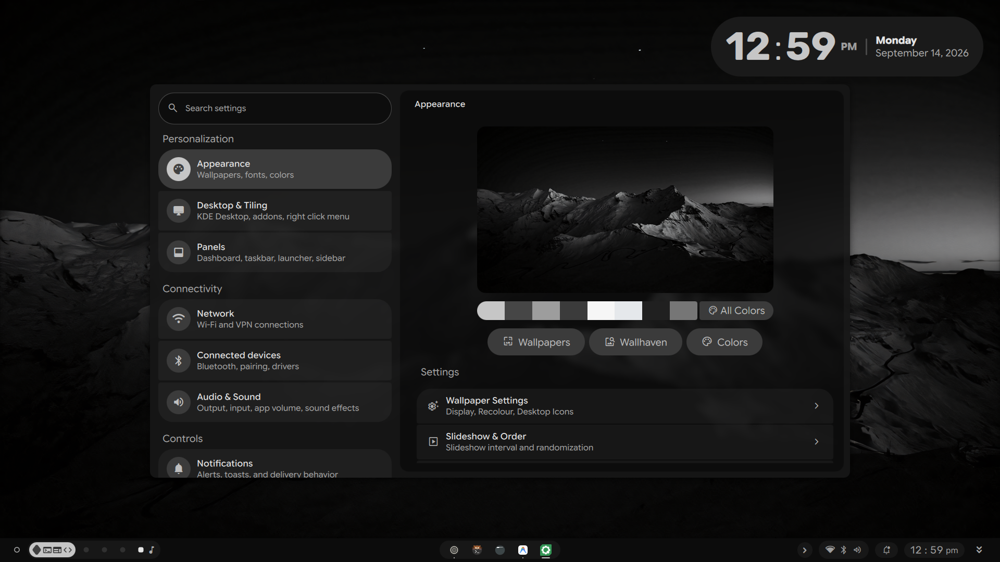
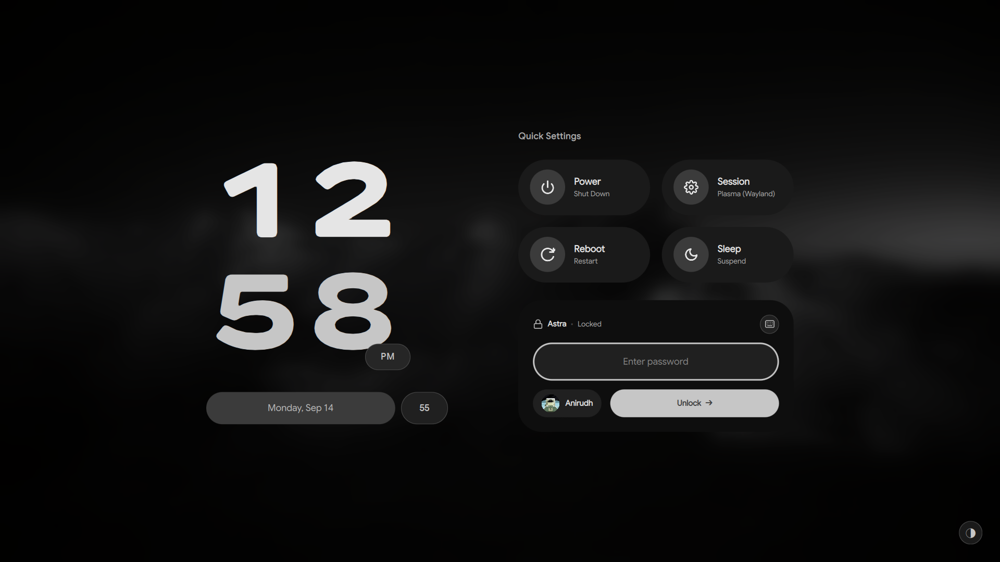

# Astra Dots

A technical configuration repository for Arch Linux, KDE Plasma 6.4, and the Caelestia Quickshell desktop shell.

- **Showcase Website & Interactive Simulator**: [https://astra-dots.github.io](https://astra-dots.github.io)
- **Technical Documentation & Reference**: [https://astra-dots.github.io/docs/](https://astra-dots.github.io/docs/)

---

## 1. System Specifications

| Item | Specification |
| :--- | :--- |
| **Operating System** | Arch Linux (Linux Kernel 6.13) |
| **Display Server** | Wayland |
| **Desktop Environment** | KDE Plasma 6.4 |
| **Desktop Shell** | Quickshell (Fork: [astra-dots/caelestia-kde](https://github.com/astra-dots/caelestia-kde)) |
| **Login Greeter** | SDDM (Custom Material You theme with Google Sans Flex) |
| **Terminal Emulator** | Kitty |
| **Shell and Prompt** | Zsh and Starship |
| **Color Extraction** | Matugen (Material Design 3 algorithmic palette) |
| **Audio Subsystem** | PipeWire with WirePlumber device deduplication |
| **Media Player** | Spotify with Spicetify and synchronized lyric visualizer |
| **System Monitor** | Btop |
| **File Manager** | Dolphin (GUI) and Yazi (CLI) |

---

## 2. Visual Overview

### 2.1 Desktop Palettes
- **Warm Amber Palette:**
  
- **Cool Cyan Palette:**
  
- **Forest Green Palette:**
  

### 2.2 Shell Drawers and Navigation
- **Application Launcher Grid:**
  
- **Quick Settings and Utilities Flyout:**
  

### 2.3 Media Subsystem
- **Media Dashboard with Synced Lyrics:**
  
- **Spotify with Spicetify Theming:**
  

### 2.4 Terminal and Shell
- **Kitty Terminal with Starship and Fastfetch:**
  

### 2.5 System Configuration and Greeter
- **Nexus Settings Control Center:**
  
- **SDDM Login Greeter (Idle State):**
  

---

## 3. Global Shortcuts

| Shortcut | Command / Target | Description |
| :--- | :--- | :--- |
| `Super + D` | `Show Desktop` | Toggle window minimization to view desktop. Shows active indicator. |
| `Super` | `caelestia shell drawers toggle launcher` | Open or close the application launcher. |
| `Super + Enter` | `kitty` | Start a terminal window. |
| `Super + Tab` | `KWin Overview` | Open the window overview grid. |
| `Super + B` | `caelestia shell drawers toggle sidebar` | Open or close the notification sidebar. |
| `Super + V` | `caelestia clipboard` | Open the clipboard history manager. |
| `Super + Shift + S` | `caelestia screenshot` | Select a screen region and take a screenshot. |
| `Super + Shift + C` | `caelestia colorpicker` | Start the color picker tool. |
| `Super + Ctrl + S` | `caelestia record` | Start or stop screen recording. |
| `Super + 1` to `5` | `KWin Workspace 1-5` | Switch to virtual desktop 1 through 5. |

---

## 4. Installation Procedure

### 4.1 Prerequisites
Install the required packages on Arch Linux before deploying:
```bash
sudo pacman -S --needed git zsh kitty btop fastfetch pipewire wireplumber sddm
yay -S --needed quickshell-git matugen-bin spicetify-cli
```

### 4.2 Clone and Deploy
Clone this repository to your home directory:
```bash
git clone https://github.com/astra-dots/dotfiles.git ~/dotfiles
cd ~/dotfiles
chmod +x install.sh
./install.sh
```

The installer script completes these steps:
1. Detects existing configuration files in `~/.config` and `~/.local`.
2. Moves conflicting files to a timestamped backup directory: `~/.dotfiles_backup_<timestamp>/`.
3. Creates symbolic links from `~/dotfiles` to target locations.

### 4.3 Install the SDDM Theme
To install the SDDM theme to the system directory, execute:
```bash
sudo cp -r ~/dotfiles/sddm/material-you-caelestia /usr/share/sddm/themes/
```

Verify the theme in test mode:
```bash
/usr/bin/sddm-greeter-qt6 --test-mode --theme /usr/share/sddm/themes/material-you-caelestia
```

---

## 5. Synchronization Tool

Use the `sync.sh` script to manage changes between the live system and the repository.

### Check Status
Display file differences:
```bash
./sync.sh status
```

### Save System Changes
Copy updated system files into the repository and commit:
```bash
./sync.sh push
```

### Pull Remote Updates
Download updates from GitHub and refresh links:
```bash
./sync.sh pull
```

---

## 6. Repository Architecture

```text
dotfiles/
├── assets/
│   └── screenshots/        # High-resolution system screenshots
├── config/
│   ├── btop/               # System monitor theme and layout
│   ├── caelestia/          # Shell user configuration (shell.json)
│   ├── fastfetch/          # System information layout (config.jsonc)
│   ├── kitty/              # Terminal configuration and themes
│   ├── matugen/            # Material Design 3 templates and settings
│   ├── spicetify/          # Spotify player styling and extensions
│   ├── starship.toml       # Cross-shell prompt configuration
│   ├── wireplumber/        # Audio device configuration rules
│   └── yazi/               # Terminal file manager configuration
├── docs/                   # Detailed technical documentation
│   ├── components.md       # Component breakdown and architecture
│   ├── installation.md     # Step-by-step setup instructions
│   ├── keybinds.md         # Complete keyboard shortcut table
│   └── troubleshooting.md  # Common issues and diagnostic commands
├── home/
│   └── .zshrc              # Interactive Zsh shell configuration
├── kde/
│   ├── kdeglobals          # Plasma color schemes, icons, and fonts
│   ├── kglobalshortcutsrc  # Global keyboard shortcut definitions
│   └── kwinrc              # Window manager behavior and effects
├── scripts/
│   ├── install.sh          # Non-destructive deployment script
│   └── sync.sh             # Bidirectional synchronization script
├── sddm/
│   └── material-you-caelestia/ # SDDM greeter theme with Google Sans Flex
├── CREDITS.md              # Upstream author credits and licenses
├── LICENSE                 # GNU General Public License v3.0
└── README.md               # Main documentation entry point
```

---

## 7. Documentation Index

For in-depth guides, refer to the `docs/` directory:
- [Installation Guide](docs/installation.md)
- [Keybindings Reference](docs/keybinds.md)
- [Component Architecture](docs/components.md)
- [Troubleshooting and Diagnostic Commands](docs/troubleshooting.md)

---

## 8. AI Development Assistance

The system configurations, technical customizations, automation scripts, and documentation in this repository were created, adapted, and refined with the assistance of AI Large Language Models (LLMs).

---

## 9. License

This repository is distributed under the GNU General Public License v3.0. Refer to [LICENSE](LICENSE) and [CREDITS.md](CREDITS.md) for full details.
